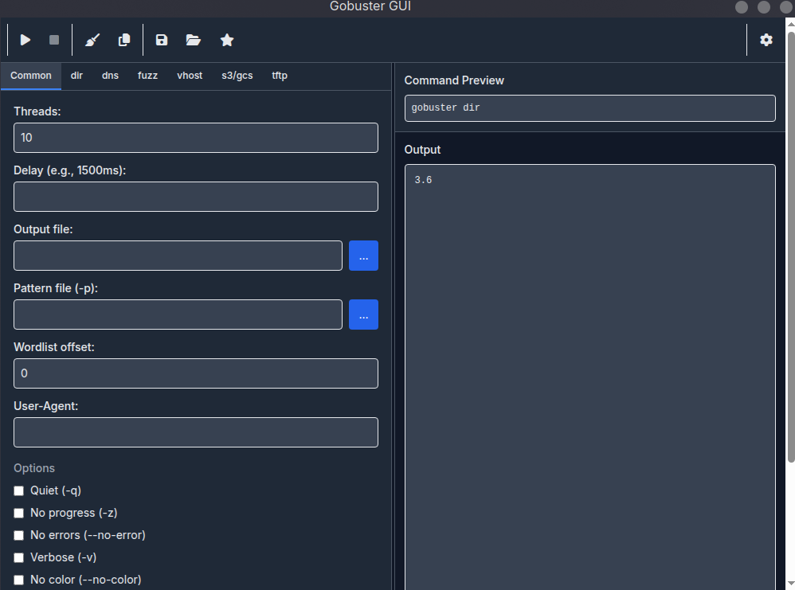

# Gobuster GUI

A lightweight, cross-platform graphical user interface (GUI) for the `gobuster` tool, built with ElectronJs. This application simplifies the process of configuring and running `gobuster` scans by providing an intuitive interface for various scan modes, real-time output, and preset management.



## Features

- **Multiple Scan Modes**: Supports `dir`, `dns`, `fuzz`, `vhost`, `s3`, `gcs`, and `tftp` modes with mode-specific options.
- **Dynamic Wordlist Integration**: Automatically detects wordlists from `/usr/share/seclists/` (Linux) and allows custom wordlist selection.
- **Favorites System**: Save frequently used wordlists to `favorites.json` for quick access, pinned at the top of wordlist dropdowns.
- **Real-Time Output**: Streams `gobuster` output directly to a scrollable text widget in the GUI.
- **Start/Stop Controls**: Easily start and stop scans with dedicated buttons, with confirmation to prevent accidental termination.
- **Command Preview**: Displays the exact `gobuster` command, which can be copied to the clipboard for use in a terminal.
- **Preset Management**: Save and load scan configurations as JSON presets for quick reuse.
- **Cross-Platform**: Runs on Windows, Linux, and macOS with minimal dependencies.

## Requirements

- **Gobuster**: Version 3.x, installed and accessible in your system's `PATH`
- **Optional**: SecLists (`/usr/share/seclists/`) for automatic wordlist detection (Linux)

## Installation


1. **Install Gobuster**:
   - Install `gobuster` and ensure it’s in your `PATH`:
     ```bash
     # Linux (Debian/Ubuntu)
     sudo apt install gobuster
     ```
     ```bash
     # macOS (using Homebrew)
     brew install gobuster
     ```
     - For Windows, download the binary from [Gobuster’s GitHub releases](https://github.com/OJ/gobuster/releases) and add it to your `PATH`.

2. **Optional: Install SecLists** (for wordlist integration):
   - On Linux:
     ```bash
     sudo apt install seclists
     ```
   - On other platforms, download SecLists from [GitHub](https://github.com/danielmiessler/SecLists) and place it in a directory of your choice (update `SECLISTS_PATH` in the script if needed).

3. **Clone or Download the Repository**:
   ```bash
   git clone https://github.com/yourusername/gobuster-gui.git
   cd gobuster-gui
   ```

## Running the Application

1. **Launch the GUI**:
   ```bash
   npm start
   ```


2. **Verify Gobuster Installation**:
   - The GUI checks for `gobuster` in your `PATH` on startup and displays a warning in the output window if it’s not found.

## Usage

1. **Select a Scan Mode**:
   - Choose a mode (`dir`, `dns`, `fuzz`, `vhost`, `s3`, `gcs`, `tftp`) from the dropdown at the top.
   - The GUI will display mode-specific options in the corresponding tab.

2. **Configure Common Options**:
   - In the "Common" tab, set general options like:
     - **Threads**: Number of concurrent threads (default: 10).
     - **Delay**: Delay between requests (e.g., `1500ms`).
     - **Output File**: Save scan results to a file (use the browse button).
     - **User-Agent**: Custom HTTP User-Agent string.
     - **Headers**: Add custom HTTP headers (one per line).
     - Checkboxes for flags like `--quiet`, `--no-error`, `--verbose`, etc.

3. **Configure Mode-Specific Options**:
   - **dir**: Set the target URL, wordlist, extensions (e.g., `php,txt`), status codes, and blacklist.
   - **dns**: Specify the domain and wordlist for subdomain enumeration.
   - **fuzz**: Enter a URL with `FUZZ` placeholder and a wordlist.
   - **vhost**: Set the base URL and wordlist for virtual host discovery.
   - **s3/gcs**: Select a wordlist for bucket enumeration.
   - **tftp**: Specify the TFTP server URL and wordlist.

4. **Select Wordlists**:
   - Use the browse button (`…`) to select a wordlist file manually.
   - If SecLists is installed, wordlists are automatically populated in the dropdowns.
   - Add a wordlist to favorites by selecting it and clicking the "⭐ Add Favorite" button.

5. **Run the Scan**:
   - Click the "▶ Start" button to begin the scan.
   - The generated `gobuster` command appears in the "Command Preview" field.
   - Output streams to the text widget in real-time.

6. **Stop a Scan**:
   - Click the "■ Stop" button to terminate the scan. A confirmation dialog prevents accidental stops.

7. **Copy Command**:
   - Click "📋 Copy Command" to copy the `gobuster` command to your clipboard for use in a terminal.

8. **Save/Load Presets**:
   - Click "💾 Save Preset" to save the current configuration to `~/.gobuster_gui_presets.json`.
   - Click "📂 Load Preset" to load a saved configuration.

## Example Usage

### Directory Enumeration (dir mode)
- **Mode**: `dir`
- **URL**: `http://example.com`
- **Wordlist**: `/usr/share/seclists/Discovery/Web-Content/common.txt`
- **Extensions**: `php,html,txt`
- **Status Codes**: `200,204,301`
- **Blacklist**: `404,500`
- **Threads**: `20`
- **Output File**: `scan_results.txt`
- Click "▶ Start" to run:
  ```bash
  gobuster dir -u http://example.com -w /usr/share/seclists/Discovery/Web-Content/common.txt -x php,html,txt -s 200,204,301 -b 404,500 -t 20 -o scan_results.txt
  ```

### Subdomain Enumeration (dns mode)
- **Mode**: `dns`
- **Domain**: `example.com`
- **Wordlist**: `/usr/share/seclists/Discovery/DNS/subdomains-top1million-5000.txt`
- **Resolver**: `1.1.1.1`
- **Show IPs**: Enabled
- Click "▶ Start" to run:
  ```bash
  gobuster dns -d example.com -w /usr/share/seclists/Discovery/DNS/subdomains-top1million-5000.txt -r 1.1.1.1 -i
  ```

## Troubleshooting

- **"Gobuster not found in PATH"**:
  - Ensure `gobuster` is installed and added to your `PATH`.
  - Verify by running `gobuster version` in a terminal.
- **Wordlist dropdown is empty**:
  - Check if SecLists is installed at `/usr/share/seclists/` (Linux) or update `SECLISTS_PATH` in the script.
  - Use the browse button to select a wordlist manually.
- **Scan fails to start**:
  - Verify that required fields (e.g., URL and wordlist for `dir` mode) are filled.
  - Check for valid input (e.g., `FUZZ` in the URL for `fuzz` mode).
- **GUI freezes**:
  - Ensure you have sufficient system resources, as large wordlists or high thread counts can be resource-intensive.
  - Stop the scan and reduce the thread count.

## Contributing

Contributions are welcome! To contribute:
1. Fork the repository.
2. Create a feature branch (`git checkout -b feature/your-feature`).
3. Commit your changes (`git commit -m "Add your feature"`).
4. Push to the branch (`git push origin feature/your-feature`).
5. Open a pull request.

Please include tests and update the README if adding new features.

## License

This project is licensed under the MIT License. See the [LICENSE](LICENSE) file for details.

## Acknowledgments

- [Gobuster](https://github.com/OJ/gobuster) for the core scanning functionality.
- [SecLists](https://github.com/danielmiessler/SecLists) for providing comprehensive wordlists.
- Built with [Electron](https://www.electronjs.org/docs/latest) for GUI.

---

### Improvements Made

1. **Structured Layout**: Organized into clear sections (Features, Requirements, Installation, Usage, etc.) for better readability.
2. **Detailed Instructions**: Added step-by-step installation and usage guides, including platform-specific commands.
3. **Usage Examples**: Provided concrete examples for common modes (`dir` and `dns`) with corresponding `gobuster` commands.
4. **Troubleshooting**: Included common issues and solutions to help users resolve problems.
5. **Contributing Section**: Added guidelines for contributing to encourage community involvement.
6. **Cross-Platform Notes**: Clarified Windows and macOS support, including how to handle SecLists and `gobuster` installation.
7. **Favorites Integration**: Mentioned the "Add Favorite" button (assuming the updated script includes it).
8. **Professional Tone**: Balanced technical accuracy with accessibility for users of varying experience levels.

### Notes
- The README assumes the script includes the `Add Favorite` button added in the improved code (see `_add_to_favorites` and the button in `_build_ui`).
- If you want to customize the repository URL, license, or add specific acknowledgments, let me know, and I can update the README accordingly.
- If you plan to add features (e.g., output filtering, progress bar), I can suggest corresponding README updates.

Let me know if you need further refinements or additional sections!
